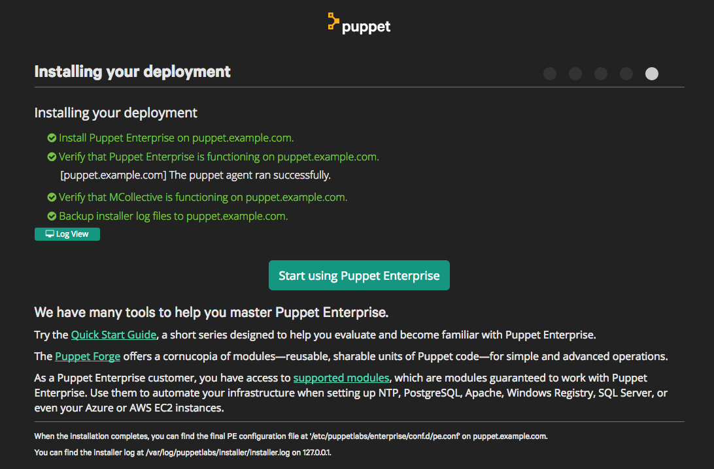
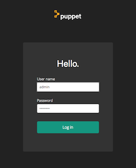
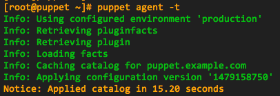

<-- [Back](02-Prep-to-Install-Puppet-Master.md#lab-2)

---

### **Lab #3** - Install Puppet Enterprise

---

### Overview

Time to complete:  45 minutes

In this lab we will install Puppet Enterprise 2016.4.0

* PE is free to install and evaluate
* When running PE without a license, you're limited to 10 agents


### Get logged in to your puppet VM

We are about to install Puppet Enterprise, and make sure you're
logged into our puppet master host.

### Note about root

When connecting to a Vagrant-provisioned VM with **vagrant ssh** you will be
logged in as the **vagrant** user (a normal/unprivileged user).  However, we
need root privileges when installing Puppet Enterprise.

In order to simplify the commands we run in the following sections, I will assume
you know how to use sudo, and when to use it.  All puppet commands need to be run
as root, so the easiet thing to do would just to become root.  We're in a training
environment after all, and if you mess something up, you can just delete it and
start over.

So, if you're already root, Great!

If you're not the root user yet, then become root, and be happy!

```
     sudo su -
```

### Run The Installer

Now let's un-compress/de-archive the PE installation tarball, and install...

Change into the directory with the PE software:

```shell
     cd /share/software/puppet
     tar xzvf puppet-enterprise-2016.4.0-el-7-x86_64.tar.gz
     cd puppet-enterprise-2016.4.0-el-7-x86_64
```

Then run the installer:

```
     ./puppet-enterprise-installer
```

The installer will prompt you:


```
=============================================================
    Puppet Enterprise Installer
=============================================================
Puppet Enterprise offers two different methods of installation.

 [1] Guided install

Recommended for beginners. This method will install and configure a temporary
webserver to walk you through the various configuration options.

NOTE: This method requires you to be able to access port 3000 on this machine
from your desktop web browser.

 [2] Text-mode

Recommended for advanced users. This method will open your $EDITOR (vi)
with a PE config file (pe.conf) for you to edit before you proceed with installation.

The pe.conf file is a HOCON formatted file that declares parameters and values needed to
install and configure PE.
We recommend that you review it carefully before proceeding.

=============================================================


 How to proceed? [1]:
```

Accept the default `[1]` (just press Return/Enter).

Some packages will be installed, and then the installer will prompt you do
open a page in your web browser...

```
## We're preparing the Web Installer...

2016-11-14 17:39:20,482 Running command: mkdir -p /opt/puppetlabs/puppet/share/installer/installer
2016-11-14 17:39:20,487 Running command: cp -pR /share/software/puppet/puppet-enterprise-2016.4.0-el-7-x86_64/* /opt/puppetlabs/puppet/share/installer/installer/

## Go to https://puppet.example.com:3000 in your browser to continue installation.

## Be sure to use 'https://' and that port 3000 is reachable through the firewall.
```

Remember that we have **forwarded port 3000 to 22000** on our workstation, so...

* Use web browser to connect to: **<https://127.0.0.1:22000/>**
* Click **Let's Get Started**
* Click **Monolithic Install**
* For FQDN, enter **puppet.example.com**
* For DNS alias, enter **puppet**
* Select: Install PostgreSQL on the PuppetDB host for me.
* Enter an initial password for the admin user (we will change it later)
* Click **Submit**
* Click **Continue**

Note:  Don't worry about the memory and disk space warnings.  The amount
of memory and disk space we've provisioned will be just fine for this training
exercise.  Obviously, when deploying for a real production environment, you'd
want to pay attention to these!

You will see this:

```
     We're checking to make sure the installation will work correctly
     Verify local environment.
     Verify that 127.0.0.1 can resolve puppet.example.com.
     Verify root access on puppet.example.com.
     Verify that DNS is properly configured for puppet.example.com.
     Verify that your hardware meets requirements on puppet.example.com.
     [puppet.example.com] We found 2,847 MB RAM. We recommend at least 4096 MB.
     Verify that 127.0.0.1 has a PE installer that matches puppet.example.com's OS.
     Verify that '/opt', '/var', and '/tmp' contain enough free space on puppet.example.com.
     [puppet.example.com] Insufficient space in '/opt' (16 GB); we recommend at least 100 GB for a production environment.
```

Click **Deploy Now**

```
     Intalling your deployment
     Install Puppet Enterprise on puppet.
     Verify that Puppet Enterprise is functioning on puppet.
     [puppet] The puppet agent ran successfully.
     Verify that MCollective is functioning on puppet.
     Backup installer log files to puppet.
```

During the installation process you may click on 'Log view' to see what is
happening behind the scenes, and then click 'Summary View' to return back to
the overview.



Note:  Once the installation completes, clicking the 'Start Using Puppet
Enterprise' button will **not** work, as we are port-forwarding from a
VM to our localhost.  Use the link below instead.

---

### Login to the PE Console

We've forwarded port 443 from our puppet VM to port 22443 on our hosting workstation, so you should be able to connect to the PE Console via the URL:

* PE Console URL:  **<https://127.0.0.1:22443/>**



Login as **admin** and enter the admin password you chose during the install.

If you forgot (or not sure what you typed) you can find the password in the answers file:

```
     grep console_admin_password /opt/puppetlabs/puppet/share/installer/conf.d/puppet.example.com.conf
```

Probabbly a good idea to **change it**...!  (You can change the admin password via the PE Console Web-Interface)

### Log files

All log files for Puppet Enterprise and its components can be found in:  `/var/log/puppetlabs/`

If you would like to look at the install logs, they are available within `/var/log/puppetlabs/installer/`

---

Believe it or not, that's all there is to installing a **Monolithic** puppet
server.

Although we wont cover the **Split** install, nor the **Large Environment Install**
in this tutorial, it may be helpful to understand what they are:

### What is a Split / LEI Install ?

A Split install would consist of 3 hosts (or VMs) with the various components split across them as follows:

* Host 1
    - Puppet Master (Compile Master)
    - Certificate Authority (CA)
    - ActiveMQ Broker (used by MCollective)
* Host 2
    - Puppet Enterprise Console
* Host 3
    - Puppet DB
    - PostgreSQL Database (backing for PuppetDB)

A **Large Environment Install** takes it a step further and scales out the ActiveMQ infrastructure used
by MCollective, and more importantly, the **Puppet Compile Masters**.  In this example we've added multiple
ActiveMQ Spokes and multiple Compile Masters (which the Puppet agents would point to).   Only the PE
infrastructure hosts would point to the MoM for their configuration.  Additional Compile Masters and
ActiveMQ Spoke Brokers could be added to scale out.

* Host 1
    - Puppet Master of Masters (MoM)
    - Certificate Authority (CA)
    - ActiveMQ Spoke Broker (used by MCollective)
* Host 2
    - Puppet Enterprise Console
* Host 3
    - Puppet DB
    - PostgreSQL Database (backing for PuppetDB)
* Host 4
    - ActiveMQ Hub Broker
* Host 5
    - ActiveMQ Spoke Broker
* Host 6
    - ActiveMQ Spoke Broker
* Host 7
    - Puppet Compile Master (load balanced)
* Host 8
    - Puppet Compile Master (load balanced)
* Host 9
    - Puppet Compile Master (load balanced)

A **Split** and/or **Large Environment Install** is a bit more work, as we'd be
splitting up the various parts of PE on to separate VM's, as well as deploying
multiple compile masters behind a loadbalancer.  If you're interested
in learning more about a split install, you may read about it in the
[PE Installation Guide](https://docs.puppet.com/pe/2016.4/install_pe_mono.html).
Here are the relevant pages:

* [Split Installation](https://docs.puppetlabs.com/pe/2016.4/install_pe_split.html)
* [Scale Compile Masters](https://docs.puppet.com/pe/2016.4/install_multimaster.html)
* [Scale ActiveMQ](https://docs.puppet.com/pe/2016.4/install_add_activemq.html)
* [Scale Console](https://docs.puppet.com/pe/2016.4/install_add_dashboard_workers.html)

Okay, let's get back to the lab...

---

### Back to the PE Console...

Let's play around in the PE Console a bit.  To change the 'admin' account
password, click on 'admin' in the top right corner, and select 'My Account'.
You should find a 'Reset password' link near the top/right of that page.

Look around the PE console.  Try clicking on the **Events**, **Nodes**,
and **Classification** tabs to see what you can see.

You should see 1 agent is registered called
**puppet.example.com**.  This is your Puppet Master!


### Test your Puppet installation...

Test your PE installation by running the agent manually from the shell prompt like this:

```
     puppet agent -t
```

Note:  Even on the Puppet Master, the Agent runs regularly in the background
as a service.  The Master configures itself through Puppet.  Be aware, if you
make a puppet change that affects all nodes, you will be affecting the master
config as well (e.g. a global change to /etc/hosts).

Do not be fearful!  Just be careful, and think about how your changes will
affect every node in your ecosystem.

Do **not** disable the puppet agent on the master thinking that you're guarding
against accidental changes that could break your puppet infrastructure.  The
agent runs on the master are required for mcollective key distribution (they
get stored in the PuppetDB and then installed on the other nodes of puppet infra
via exported resources).  Also, there are certain configuration params
in the puppet.conf on the master that are managed by puppet itself.


```shell
    [root@puppet ~]# puppet agent -t
    Info: Retrieving pluginfacts
    Info: Retrieving plugin
    Info: Loading facts
    Info: Caching catalog for puppet.example.com
    Info: Applying configuration version '1477070396'
    Notice: Finished catalog run in 5.03 seconds
```

Not too exciting.  We have confirmed that the agent run succeeds, so we know the puppetmaster is up and running and able
to build a catalog for itself. Good.

If you're on a terminal that supports ANSI color, you'll notice that the text
is in **GREEN**.  If there are any puppet errors during a puppet run, those errors
would show up in **RED** text.



Okay, let's move on...

---

Continue to **Lab #4** --> [Install Puppet Agent on agent node, and do test puppet run](04-Install-Puppet-Agent.md#lab-4)

---

### Further Reading

These links are not needed for this Lab, but for reference here's the PE Install Guide at the PuppetLabs web site:

Quick Start Guide:  <https://docs.puppetlabs.com/pe/2016.4/quick_start_install_mono.html>

Detailed Install Guide:  <https://docs.puppetlabs.com/pe/2016.4/install_basic.html>

Split Install:   <https://docs.puppetlabs.com/pe/2016.4/install_pe_split.html>

LEI Install:   <https://docs.puppetlabs.com/pe/2016.4/install_multimaster.html>

---

<-- [Back to Contents](/README.md)

---

Copyright © 2016 by Mark Bentley

