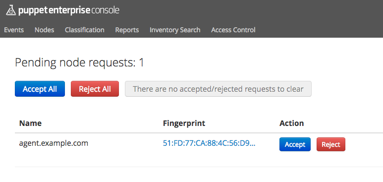
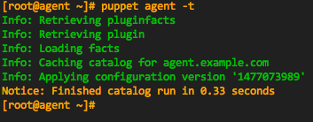

<-- [Back](03-Install-Puppet-Master.md#lab-3)

---

# **Lab #4** - Install the Puppet Agent

---

## Overview

Time to complete:  10-15 minutes

In this lab we will:

* Manually edit the /etc/hosts to prepare for the agent install
* Install the Puppet Agent on the **agent** node

## Pre-installation Steps

Make sure your **agent** VM or container is started, and get logged in.

If using Vagrant, start your VM, and connect to it via ssh:

```
     vagrant up agent
     vagrant ssh agent
```

## Edit the hosts file

Edit **/etc/hosts** and make sure it looks exactly like this (delete any other lines):
(This should be the exact same hosts file as we created on the **puppet** master node)

```
127.0.0.1      localhost
192.168.198.10 puppet.example.com puppet
192.168.198.11 agent.example.com  agent
192.168.198.12 gitlab.example.com gitlab
```

In a later lab we will write the puppet code to maintain the /etc/hosts entries, but for now we add them manually.

## Install the Agent

To install the puppet agent on the **agent** node, we can take advantage of
a feature of the PE Master:  The PE Master makes available the agent installer
behind its own web server.  You can use **wget** or **curl** to download the
installer script and then pipe it through bash.

* To use **wget**

```
     wget --no-check-certificate --secure-protocol=TLSv1 -O - https://puppet:8140/packages/current/install.bash | bash
```

* To use **curl**

```
     curl -k --tlsv1 https://puppet:8140/packages/current/install.bash | bash
```

If you'd like to browse what else is accessible via that web server, try
opening <https://localhost:22140/packages> in your workstation's web browser.

(Remember we port-forwarded 8140 to 22140 on our hosting workstation)

Go ahead an install the agent if you haven't already done so, and then
try running the puppet agent...

## Run the Puppet Agent

Run the puppet agent manually.  This will cause an SSL certificate request
to be generated and sent to the puppetmaster.

```
     [root@agent ~]# puppet agent -t
     Info: Creating a new SSL key for agent.example.com
     Info: Caching certificate for ca
     Info: Caching certificate_request for agent.example.com
     Info: Caching certificate for ca
     Exiting; no certificate found and waitforcert is disabled
```

Note:  the puppet agent is also running in the background, so it may have already generated the SSL key,
so you may not see that in your output.  In that case, you would see just this:

```
[root@agent ~]# puppet agent -t
Exiting; no certificate found and waitforcert is disabled
```

## Sign the Certificate

Next, We need to sign the agent's cert on the master, so switch to your **puppet**
window/terminal and issue the following commands on the puppet master as root:

```
     puppet cert list
     puppet cert sign agent.example.com
```

The **puppet cert list** command shows any outstanding certificate signing requests.  You should see the one that was just generated by your agent run.

```
     [root@puppet ~]# puppet cert list
       "agent.example.com" (SHA256) 31:EA:4D:60:DE:44:E8:E1:A1:1A:2E:48:1E:81:CA:40:43:4A:A7:39:E8:B9:61:63:F3:0F:CF:2E:B7:CC:98:22
```

The **puppet cert sign agent.example.com** command signs the cert, and removes the signing request.

```
     [root@puppet ~]# puppet cert sign agent.example.com
     Notice: Signed certificate request for agent.example.com
     Notice: Removing file Puppet::SSL::CertificateRequest agent.example.com at '/etc/puppetlabs/puppet/ssl/ca/requests/agent.example.com.pem'
```

Alternatively, you can sign the cert through the PE Console if you wish:



## Run puppet...

Now, back on the agent node:  Let's run puppet again (be sure you're running as root)

```
     puppet agent -t
```

You should see a lot of output to the screen showing the changes that are being applied.
(Puppet is installing and configuring MCollective on the agent.)
However, because puppet runs automatically in the background every 5 minutes prior to
its certificate being signed, there is a small chance that the first puppet run will
occur before you're able to do a manual run.  In that case, you should see a little output
as in the second puppet run (no changes made.)

## Run the Puppet Agent Again

Run puppet a **second** time, and you should get a clean run with no changes.

```
     puppet agent -t
```



For brevity, I've not included the output on this page, but it's available for viewing
here:

* Puppet Run Output:  [04-Puppet-Agent-Run-Output.md](04-Puppet-Agent-Run-Output.md)

---

At this point we have:

- a **Puppet Master node** (hostname **puppet.example.com**) that also runs an agent to configure itself
- a **Puppet Agent node** (hostnamne **agent.example.com**) that runs an agent, and where we will test code and learn more about PE

If you login to the [PE Console](https://127.0.0.1:22443/nodes), you should see these two agents on the 'Nodes' page

---

Continue to **Lab #5** --> [Get familiar with puppet config files, and puppet code, and CLI](05-Puppet-Config-and-Code.md#lab-5)

---

<-- [Back to Contents](/README.md)

---

Copyright © 2016 by Mark Bentley

